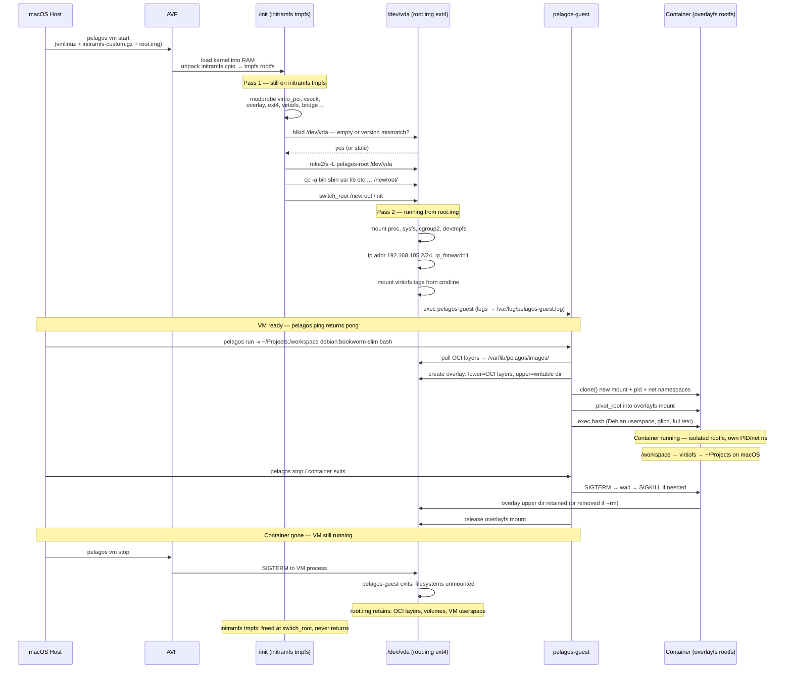
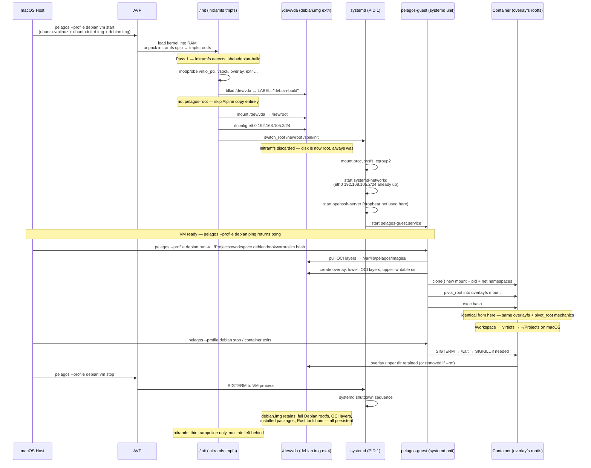

# Architecture Mental Model — Clearing Up False Assumptions

This document walks through the reasoning behind pelagos-mac's design,
specifically to correct a set of false assumptions that are easy to reach
if you approach the architecture from a traditional Linux server or Docker
daemon mental model.

---

## The Stack

```
macOS host
  └── pelagos-mac (Rust binary, aarch64-apple-darwin)
        └── Apple Virtualization Framework (AVF)
              └── Alpine Linux VM  ← kernel + initramfs only, no installed OS
                    ├── pelagos-guest daemon (AF_VSOCK)
                    ├── root.img (ext4, container state: OCI layers, volumes)
                    └── containers (each gets its own rootfs from OCI image)
                          └── your workload
```

---

## False Assumption 1: "The Alpine VM constrains what containers can do"

The Alpine initramfs is the VM's *host kernel environment* — it boots,
loads modules, starts the pelagos-guest daemon, and gets out of the way.
It is not the userspace that containers run in.

When you run `pelagos run debian:bookworm-slim bash`, the container gets
a full Debian rootfs mounted via overlayfs. Its libc is glibc. Its
userspace is Debian. The Alpine initramfs underneath is invisible to the
container. They do not share userspace at all.

This means: the choice of Alpine for the VM host has zero effect on what
you can run inside containers. You can run glibc binaries, Ubuntu
containers, Debian containers, anything — inside the Alpine VM, without
any Alpine-specific constraints.

---

## False Assumption 2: "We need a persistent build VM to compile pelagos"

The original reasoning that led here:

1. Alpine uses musl libc (not glibc)
2. pelagos links against libseccomp and libcap which require glibc
3. Therefore, building pelagos inside Alpine fails
4. Therefore, we need a persistent Ubuntu or Debian VM with glibc

Steps 1 and 3–4 don't follow because step 2 is **false**. pelagos does
not link against libseccomp or libcap. It uses the pure-Rust
`seccompiler` crate and raw `SYS_capset` syscalls. Both pelagos and
pelagos-guest are static musl binaries, released as such.

**The architectural answer:** pelagos can be built inside a
`debian:bookworm-slim` container in the default Alpine VM — no persistent
VM is architecturally required. The source tree mounts from macOS via
virtiofs; build artifacts land on the macOS filesystem and persist across
container restarts.

**What we actually use:** The `build` profile (Ubuntu persistent VM) exists
and is used in practice, not because it is architecturally necessary but
because direct SSH access with a persistent toolchain is a more natural
interactive workflow than running a container for every build. Both paths
are valid; the build profile is simply more convenient for iterative
development. See `VM_PROFILES.md` for the full comparison.

---

## False Assumption 3: "We need a persistent build VM for a persistent toolchain"

If reinstalling tools on every `pelagos run` is the problem, the solution
is a custom image — not a persistent VM. Write a Remfile:

```
FROM debian:bookworm-slim
RUN apt-get install -y build-essential pkg-config curl git
RUN curl --proto '=https' --tlsv1.2 -sSf https://sh.rustup.rs | sh -s -- -y
```

Build it once:

```bash
pelagos build -t my-build-env:latest
```

Use it repeatedly:

```bash
pelagos run -v $HOME/Projects/pelagos:/workspace my-build-env:latest \
  sh -c "cd /workspace && cargo build"
```

The toolchain is baked into the image. Source and artifacts persist on
macOS via virtiofs. The default Alpine VM handles all of it.

This is the architecturally clean answer. In practice the `build` profile
is often more ergonomic for interactive work — but it is a convenience
choice, not a requirement.

---

## False Assumption 4: "Debian is ~7x lighter than Ubuntu as a VM"

The 7x size difference (debian:bookworm-slim ~100 MB vs ubuntu:22.04
~700 MB+) applies to **OCI container image layers** — the thin filesystem
snapshots used by container runtimes.

As **persistent VM disk images**, once you add systemd, openssh-server,
build-essential, libseccomp-dev, libcap-dev, and a Rust toolchain, both
land at ~2.1 GB used on a 10 GB ext4 partition. Identical.

The `debian` VM profile we built as a "lighter alternative" to the
`build` (Ubuntu) VM is not meaningfully lighter for this use case.

---

## False Assumption 5: "A persistent build VM gives us something SSH into Alpine doesn't"

Dropbear SSH is already in the Alpine initramfs. `pelagos vm ssh` works
against the default profile.

The only thing a persistent VM's SSH session gives you that Alpine SSH
doesn't is: **state that survives reboots**. Packages you `apt install`,
files you write to the VM's own filesystem. Alpine's initramfs is
read-only and rebuilt from scratch on each boot.

But again — if you want persistent state, virtiofs (for files) and
custom OCI images (for toolchains) solve that without a persistent VM.

---

## So When Is a Persistent VM Actually Needed?

Genuinely rarely. The only cases that cannot be addressed by
containers + virtiofs + custom images:

1. **Provisioning other VM images.** Building `out/build.img` or
   `out/debian.img` requires formatting a block device and running
   `chroot`-based provisioning. This happens on the macOS host using the
   Alpine VM as a tool. It's not a container workload.

2. **Running systemd as init.** If your workflow requires a full systemd
   init tree — not just a process, but units, services, journal — then a
   persistent VM with systemd is the right answer. This is a narrow use
   case.

3. **"I want a traditional persistent Linux box."** Legitimate, but it's
   an ergonomic preference, not an architectural requirement. The `build`
   profile name is a misnomer — it should be called `linux` or
   `persistent`.

---

## musl vs glibc — What Actually Matters

**musl** is Alpine's C library: small, strict POSIX, designed for static
linking. **glibc** is the GNU C Library: large, broad compatibility,
used by Debian/Ubuntu/most mainstream Linux.

They are binary-incompatible. A binary compiled against glibc cannot run
on a musl system and vice versa.

### pelagos is already a static musl binary

This is the important correction to the reasoning that led us toward a
persistent build VM. pelagos does **not** link against libseccomp or
libcap. It never did:

- **seccomp**: uses the `seccompiler` crate (pure Rust, same one used by
  Firecracker) — no libseccomp C library
- **capabilities**: uses raw `libc::syscall(SYS_capset, ...)` — no libcap
- **bzip2/xz2**: statically linked via `features = ["static"]` in
  Cargo.toml, explicitly for musl portability

The CI release workflow builds `aarch64-unknown-linux-musl` and
`x86_64-unknown-linux-musl` as the primary release format. Both pelagos
and pelagos-guest are static musl binaries.

The real musl portability challenges that were solved were about **type
incompatibilities at the Rust/C FFI boundary**:

- `rlimit` resource constants: `c_uint` on glibc, `c_int` on musl —
  fixed with `#[cfg(target_env = "gnu")]` conditional compilation
- `ioctl` request argument: `c_ulong` on glibc aarch64, `c_int` on musl
  aarch64 — fixed with `as _` casts that let rustc pick the right type
- `statfs.f_type`: `libc::__fsword_t` doesn't exist on musl — fixed by
  casting to `u64` for a portable comparison

These were one-time fixes. Once in place, pelagos builds cleanly as
static musl on both x86_64 and aarch64.

### Consequence for the "build VM" question

Since pelagos is static musl, you can build it inside an `alpine` or
`rust:alpine` container in the default Alpine VM — no glibc required.
The entire justification for needing a glibc build environment to compile
pelagos was false.

### Where musl vs glibc does matter

The constraint applies to the *VM host's userspace*, not to containers.
Containers bring their own libc. A `debian:bookworm-slim` container
running inside the Alpine VM has glibc and can link against glibc system
libraries without issue. But this only matters if you are building
software that genuinely requires glibc — which pelagos does not.

---

## Why the Alpine Initramfs Is the Right Choice for the Default VM

The default VM exists to run containers. Its entire job is:

1. Boot
2. Load kernel modules (virtio, vsock, overlayfs, networking)
3. Start pelagos-guest on AF_VSOCK
4. Get out of the way

An initramfs does all of this. It is a read-only compressed cpio archive
loaded into RAM at boot. There is nothing to maintain, nothing to update,
no package manager to run. If a change is needed, rebuild the initramfs
with `build-vm-image.sh`.

The persistent disk (`root.img`) stores only container state: OCI image
layers, volumes, overlay filesystems. The VM's own userspace has zero
persistence requirement, because it has no userspace in the traditional
sense — it IS the container runtime.

This is the same philosophy as CoreOS/Flatcar: an immutable, purpose-built
OS for running containers. The immutability is a feature — the runtime
environment is always exactly what was built, with no drift.

musl + static pelagos-guest fits this perfectly: no glibc runtime needed
in the initramfs. A glibc build would require shipping several MB of
shared libraries for no benefit.

---

## The Role of the Initramfs and pivot_root

### What the initramfs actually is

The kernel (`vmlinuz`) and initramfs (`initramfs-custom.gz`) are separate
artifacts passed independently to AVF. AVF loads the kernel directly into
memory and executes it. The kernel unpacks the initramfs cpio archive into
a tmpfs rootfs in RAM and runs `/init` from it. They travel together but
are distinct things — the initramfs does not contain the kernel.

### The initramfs is a bootstrap tool, not the permanent rootfs

A common misconception: the Alpine VM runs entirely from RAM, with the
initramfs as its permanent userspace. This is wrong.

The init script runs in two passes:

**Pass 1** (rootfs is still initramfs tmpfs in RAM):
1. Load all kernel modules (virtio, vsock, overlayfs, networking, etc.)
2. Check `/dev/vda` (root.img) — if empty or version-mismatched, copy the
   Alpine userspace from the initramfs to `/dev/vda` (ext4 on disk)
3. `switch_root /newroot /init` — pivot from initramfs tmpfs to `/dev/vda`

**Pass 2** (rootfs is now `/dev/vda`, ext4 on disk):
4. Set up networking, mount proc/sys/cgroup/virtiofs
5. Start dropbear SSH
6. `exec pelagos-guest`

After `switch_root`, the running system is on disk. `pelagos-guest`,
`busybox`, all VM userspace — loaded from `root.img`. The initramfs is
discarded. Its only job was to bootstrap the disk and pivot to it.

This also means `root.img` serves double duty:
- **VM userspace**: the Alpine binaries that run the host environment
- **Container state**: OCI image layers, overlay upper directories, volumes

### Why copy initramfs to disk rather than using a pre-built disk image

The initramfs is the single source of truth for the VM's userspace. When
`build-vm-image.sh` builds a new guest binary or updates a kernel module,
the next boot detects the version mismatch (via `pelagos-root-version`),
re-copies from the fresh initramfs, and the disk is updated automatically.
No separate disk provisioning step required for the default profile.

### Kernel paging

The Linux kernel's own code and data structures are pinned in RAM — the
kernel never pages itself out. After `switch_root`, userspace programs
(pelagos-guest, busybox) are loaded from `root.img` as normal file I/O.
There is no separate "kernel pages from disk" step after boot.

### pivot_root: two separate operations at two different layers

`pivot_root` (and its cousin `switch_root`) appears at two distinct points
in the system's lifetime, serving different purposes:

**1. VM-level root pivot (boot time)**

`switch_root /newroot /init` in our init script. This transitions the
VM's root filesystem from the initramfs tmpfs to the ext4 disk. Happens
once at boot. After this, the initramfs memory is freed and the VM runs
from disk.

**2. Container-level root pivot (container spawn time)**

When `pelagos run` spawns a container, the pelagos runtime inside the VM:

1. Creates a new **mount namespace** for the container process
2. Assembles an **overlayfs** mount:
   - Lower layers: OCI image layers (read-only, stored on root.img)
   - Upper layer: container's writable layer (on root.img)
   - Merged: the container's complete rootfs
3. Calls `pivot_root` (or `MS_MOVE` + `chroot`) inside the new mount
   namespace, making the overlayfs the container's `/`
4. The container process now sees the OCI image's filesystem as its root,
   completely isolated from the VM's own root

This is where the container gets its own userspace — glibc if you're
running `debian:bookworm-slim`, musl if you're running `alpine`, whatever
the image provides. The VM's Alpine userspace is invisible inside the
container.

### The complete picture

```
AVF loads kernel into RAM
  │
  ├── kernel unpacks initramfs into tmpfs
  │     └── /init pass 1
  │           ├── load kernel modules
  │           ├── copy Alpine userspace to /dev/vda (if needed)
  │           └── switch_root → /dev/vda
  │
  ├── /init pass 2 (running from /dev/vda, root.img)
  │     ├── networking, proc, cgroup, virtiofs mounts
  │     ├── dropbear SSH
  │     └── exec pelagos-guest
  │
  └── pelagos-guest running, waiting on AF_VSOCK
        │
        └── on "pelagos run debian:bookworm-slim bash":
              ├── pull/unpack OCI layers → /var/lib/pelagos (on root.img)
              ├── create mount namespace
              ├── assemble overlayfs (lower=OCI layers, upper=writable)
              ├── pivot_root into overlayfs
              └── exec bash  ← now inside Debian userspace, glibc, etc.
```

Kernel code: pinned in RAM throughout.
VM userspace (busybox, pelagos-guest): on root.img after switch_root.
Container state (OCI layers, overlay dirs, volumes): on root.img.
Source trees and build artifacts: on macOS, mounted via virtiofs.

---

## Diagram 1 — Alpine VM: Full Container Lifetime



---

## Diagram 2 — Ubuntu/Debian VM (Hypothetical Container Use)

This VM boots via a different path: the initramfs detects the non-`pelagos-root`
disk label and immediately `switch_root`s to the disk's own systemd, without
copying any Alpine userspace. pelagos-guest would need to be installed on the
disk and started as a systemd unit. Everything from the container spawn onward
is identical to the Alpine VM — overlayfs, pivot_root, mount namespaces — the
boot path to get there is what differs.



### Key differences between the two boot paths

| | Alpine VM | Ubuntu/Debian VM |
|---|---|---|
| Initramfs role | Bootstrap + copies userspace to disk | Thin trampoline only |
| Disk content at first boot | Empty — filled from initramfs | Pre-provisioned by build script |
| Disk label | `pelagos-root` | `debian-build` / `ubuntu-build` |
| PID 1 | `/init` (busybox sh script) | `systemd` |
| SSH daemon | dropbear (started by /init) | openssh (systemd unit) |
| pelagos-guest startup | `exec` at end of /init | systemd unit |
| VM userspace origin | Initramfs (rebuilt by build-vm-image.sh) | Provisioned disk (rebuilt by build script) |
| Persistence of VM userspace | Refreshed from initramfs on version change | Survives reboots, updated via apt |
| Container mechanics | overlayfs + pivot_root (identical) | overlayfs + pivot_root (identical) |
