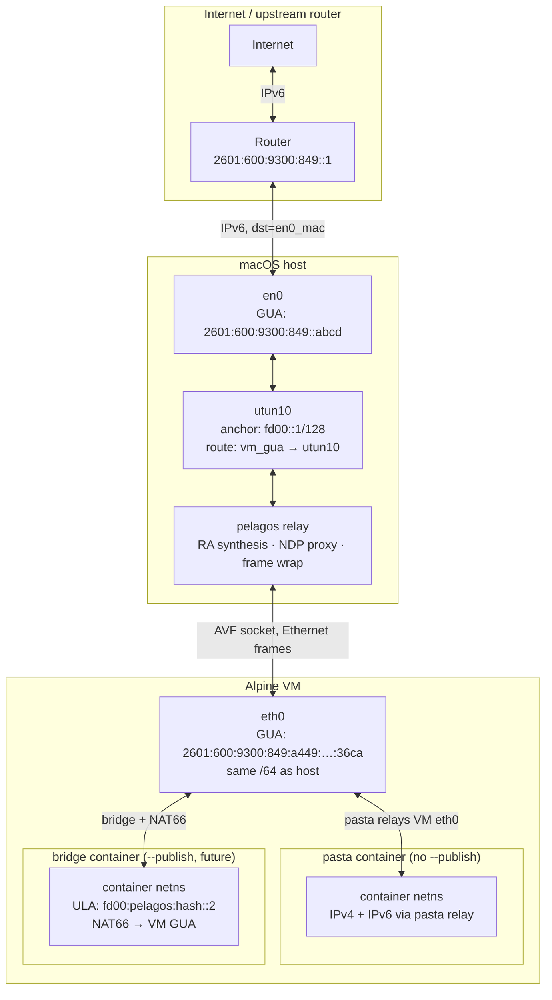
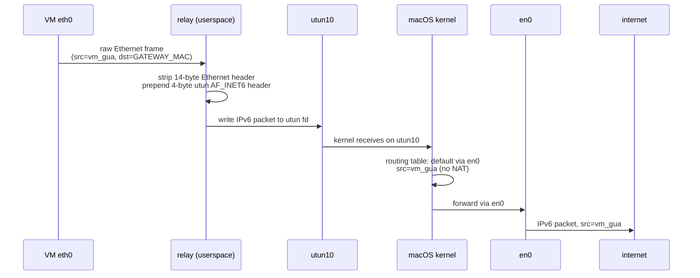
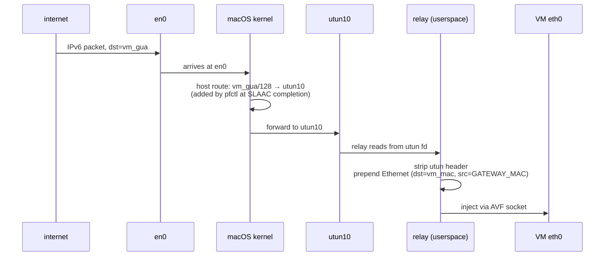
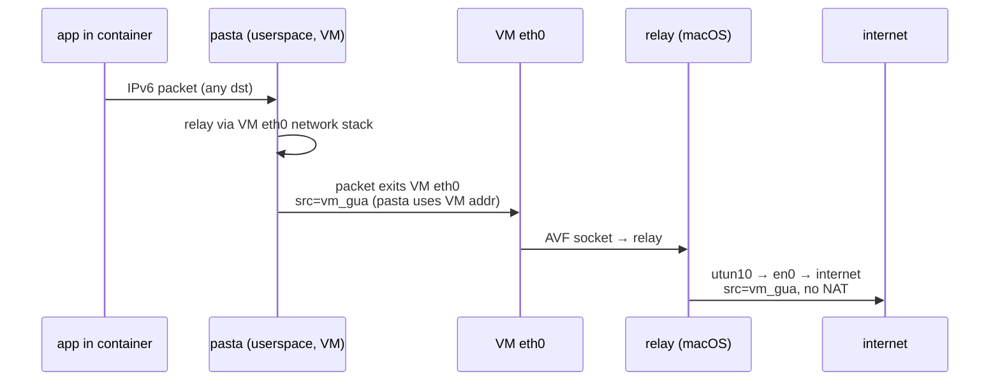
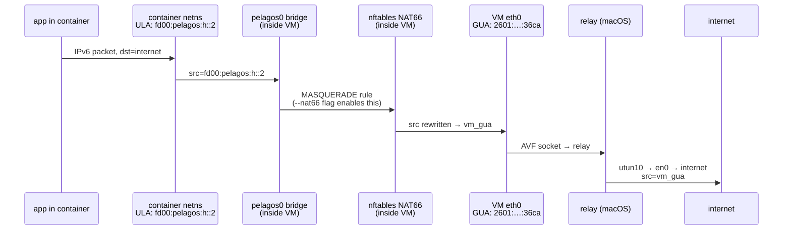

# IPv6 Networking in pelagos-mac

*VM-level IPv6 implemented in v0.6.15 (PRs #247, #250). Container-level IPv6 (#244)
is in progress — see Current Status and Container IPv6 Approach below.*

---

## Overview

The VM gets a real GUA — the same /64 prefix as the macOS host — via SLAAC.  At the
VM level, no NAT occurs for IPv6; packets flow with the VM's GUA as source and
destination, fully visible to the upstream router.  Container IPv6 is handled
differently depending on whether the container uses bridge or pasta mode — see
Container IPv6 Approach below.  The VM-level machinery requires active cooperation
from the host:

1. **RA synthesis** — the relay synthesises a Router Advertisement so the VM learns
   the /64 prefix and default router without needing one from the actual router.
2. **NDP proxy (Phase 1)** — when the VM's GUA is assigned, the pfctl helper seeds
   the upstream router's NDP cache and adds a kernel host route so inbound replies
   reach the VM.
3. **NDP proxy (Phase 2, pending #250)** — a BPF listener on en0 that responds to
   ongoing NS probes from the router, keeping the cache valid after expiry.

---

## IPv6 Addressing Background

### Address structure

An IPv6 address is 128 bits split into two 64-bit halves at a hard boundary:

- **Network prefix (high 64 bits)** — identifies the network. For a GUA like
  `2601:600:9300:849::/64`, the high bits are the ISP allocation and the subnet
  ID assigned by the router from its delegated prefix.
- **Host identifier (low 64 bits)** — identifies the interface within the network.
  Typically EUI-64 (derived from the MAC address) or a random privacy extension
  value.

The `/64` boundary is not merely convention — SLAAC, NDP, and every major
implementation treat it as fixed. A `/65` is expressible in CIDR but nothing
behaves correctly within it. To create a new subnet you must go up to a shorter
prefix and carve another `/64` from it; you cannot subdivide an existing `/64`.

### Why ISP prefix size matters

SLAAC and DHCPv6-PD assume a flat LAN gets one `/64`. Any hierarchy — VLANs,
VPN tunnel subnets, container bridges, downstream routers — requires additional
`/64`s. ISPs are supposed to delegate at least a `/56` (256 subnets) to
residential customers, but some delegate only a `/64`, making the network flat
by constraint with nothing left to sub-delegate to downstream segments.

### NAT66 and the end-to-end principle

The IETF position (RFC 5902, RFC 6296) is that NAT66 (many-to-one ULA-to-GUA
masquerade) is an antipattern that recreates IPv4 NAT's problems: stateful
translation at the border, broken application-layer protocols, and asymmetric
reachability. The correct solution is proper prefix delegation so every host has
a real GUA.

pelagos uses NAT66 for container network namespaces as a deliberate pragmatic
choice, not a philosophical one. The objection to NAT66 assumes the NATted host
should be a full internet participant. Containers on a developer laptop are
production-grade workloads under active development: they need real outbound IPv6
(pulling packages, hitting APIs, testing against external services) and may need
inbound IPv6 (testing services from the LAN or internet). NAT66 satisfies both
requirements correctly in this context. The alternative — giving every container
a GUA from the host's /64 — requires the host to have a properly delegated prefix
with room to spare, which cannot be assumed on a developer laptop on any arbitrary
network.

---

## IPv6 Address Hierarchy

There are three distinct IPv6 addresses in play — one per tier — and it matters
which tier is the NAT boundary:

| Tier | Address | Type | How assigned |
|---|---|---|---|
| Mac `en0` | `2601:600:9300:849::abcd` | Real GUA | Router SLAAC |
| VM `eth0` | `2601:600:9300:849:a449:19ff:fee3:36ca` | Real GUA (same /64!) | Relay-synthesised RA + VM SLAAC |
| Container (bridge, future) | `fd00:pelagos:<hash>::2` | ULA (private) | pelagos assigns |

The Mac and VM addresses share the same `/64` prefix — they are peers on the same
network segment from the router's perspective, not in a parent-child relationship.
The container ULA is private and masqueraded through the VM's GUA on outbound (NAT66
at the VM boundary only, not at the Mac boundary).

pasta containers bypass this entirely: pasta relays the VM's dual-stack `eth0`
directly, so the container appears to the internet as the VM's GUA with no NAT.



---

## Packet Path

### Outbound VM → internet



- Source address is the VM's GUA throughout — no NAT at any hop.
- `net.inet6.ip6.forwarding = 1` on the Mac kernel allows utun10 → en0 forwarding
  (set by default on most macOS systems).

### Inbound internet → VM



- The `/128` host route is added by `pfctl_assign_utun_alias` when the VM's GUA
  is first detected (first non-DAD packet sourced from vm_gua).
- The relay wraps the raw IP packet in an Ethernet frame so the VM's kernel sees
  a normal L2 delivery addressed to its own MAC.

### pasta container → internet (dual-stack, no NAT)



- pasta runs inside the VM on the VM's network namespace. It sees `eth0` (GUA),
  so both IPv4 (NAT44) and IPv6 (no NAT) work automatically.
- The container appears to the internet as the VM's GUA.

### bridge container → internet (future: NAT66)



- One NAT boundary only: container ULA → VM GUA.
- The Mac's `en0` GUA is never involved in the NAT — the VM's GUA is the exit point.
- Requires `--nat66` opt-in in pelagos (not yet implemented, issue #244).

---

## SLAAC — how the VM gets its GUA

The relay detects the host's GUA /64 prefix on the egress interface at startup using
`ifconfig` output.  When the VM sends a Router Solicitation (ICMPv6 type 133), the
relay synthesises a Router Advertisement containing:

- **Prefix Information option**: the real host /64 prefix, `A=1` (SLAAC), `L=1`
  (on-link), lifetime 30 days.
- **Router Lifetime**: 1800 s (so the VM installs a default route via `fe80::1`).
- **Source**: `fe80::1` (the relay's virtual link-local address on the virtual Ethernet).

The VM does SLAAC: it forms its EUI-64 IID from its MAC, appends it to the prefix,
runs DAD, and assigns the GUA to `eth0`.

The relay detects SLAAC completion by waiting for the first non-DAD IPv6 packet
sourced from the GUA (DAD NS uses `::` as source).  At that point it calls
`pfctl_assign_utun_alias` to set up the host route and NDP seed.

---

## NDP proxy — why it is needed

The upstream router knows the host's en0 MAC (`aa:bb:cc:...`).  It does NOT know
the VM's GUA.  When the router wants to deliver a packet to `vm_gua`, it first sends
a Neighbour Solicitation (NS) to the solicited-node multicast address for `vm_gua`.
Nobody on the physical LAN answers — the VM is behind the utun tunnel, not on en0.
The router marks `vm_gua` as `(incomplete)` and drops the packet.

The host must act as an NDP proxy: answer NS for `vm_gua` with an NA that names
`en0_mac` as the link-layer address.  The router then caches `vm_gua → en0_mac` and
can deliver replies.

### Phase 1 — seeding at alias time (implemented)

When `pfctl_assign_utun_alias` is called with the VM's GUA:

1. **Gratuitous NA** — an unsolicited Neighbour Advertisement (ICMPv6 type 136) is
   broadcast to `ff02::1` (all-nodes multicast) on en0, advertising
   `vm_gua → en0_mac`.  Most routers accept gratuitous NAs and update their cache.

2. **Unicast probe NS** — a Neighbour Solicitation (type 135) is sent as a unicast
   Ethernet frame directly to the router's MAC address (looked up from the host NDP
   table), sourced from vm_gua with SLLA=en0_mac.  This causes the router to send an
   NA back to the host, simultaneously seeding its own cache with `vm_gua → en0_mac`.
   **Unicast is critical**: sending to the solicited-node multicast address would also
   hit our own en0 NIC, causing the host's NDP stack to create a conflicting `/128
   UHLWI` entry for vm_gua on en0 that overrides the utun10 host route.

Both frames are injected via BPF (`/dev/bpfN` with `BIOCSETIF`).

### Phase 2 — ongoing proxy (pending, issue #250)

Router NDP caches expire (typically every 20–30 s after the router re-probes).  After
the first expiry the router sends a new NS; if nobody answers, `vm_gua` goes
incomplete again and inbound traffic stops.

Phase 2 adds a BPF listener on en0 that watches for ICMPv6 NS (type 135) targeting
vm_gua and immediately responds with an NA.  This keeps the router's cache valid
indefinitely.  Until Phase 2 lands, reachability degrades after ~30 s of idle.

---

## Virtual gateway addresses

The relay presents itself to the VM as a virtual gateway with the following fixed
addresses, all answered by NDP synthesised in the relay:

| Address | Scope | Purpose |
|---|---|---|
| `02:00:00:00:00:01` | Ethernet MAC | GATEWAY_MAC — used for all gateway Ethernet frames |
| `fe80::1` | Link-local | Default router advertised in RA; VM routes GUA traffic here |
| `fd00::1/128` | ULA | Infrastructure anchor on utun10; VM static config may use this as default gateway |

`fd00::1/128` exists solely to give utun10 an IPv6 address so the macOS kernel
accepts `route add -inet6 -host <gua> -interface utunN` (rejected with ENETUNREACH
otherwise).  The relay intercepts NDP NS for `fd00::1` and responds with GATEWAY_MAC
— the kernel routes `fd00::1` via `lo0`, so without relay interception the VM's NS
goes unanswered.

---

## Host-side setup sequence

```
relay start
  └── detect_host_gua_prefix(en0)          → gua_prefix stored in RelayState
  └── pfctl_setup_utun(utun10, en0, subnet)
        └── ifconfig utun10 inet 192.168.N.1 192.168.N.2 up
        └── ifconfig utun10 inet6 fd00::1 prefixlen 128 alias   ← IPv6 anchor
        └── pfctl NAT44 rule: nat on en0 from 192.168.N.0/24

VM sends Router Solicitation
  └── relay intercepts RS, sends synthesised RA (prefix=gua_prefix)
  └── VM does SLAAC → assigns vm_gua to eth0, DAD, then usable

VM sends first real GUA-sourced packet
  └── maybe_assign_gua_alias fires
  └── pfctl_assign_utun_alias(utun10, vm_gua)
        └── route add -inet6 -host vm_gua -interface utun10
        └── BPF: send gratuitous NA (vm_gua → en0_mac) to ff02::1
        └── BPF: send unicast probe NS (src=vm_gua, dst=router) to router_mac

Inbound IPv6 reply arrives at en0
  └── kernel route: vm_gua → utun10  →  relay reads, wraps in Ethernet → VM
```

---

## Container IPv6 Approach

Container IPv6 is split across two modes, because the bridge and pasta network paths
have different constraints.

### pasta containers (no --publish)

pasta runs inside the VM as root on the VM's network namespace.  It sees the VM's
eth0, which already has a GUA via SLAAC.  pasta automatically relays both IPv4 and
IPv6 — containers get dual-stack internet with no additional configuration.
`pelagos-guest` auto-selects pasta when `--publish` is absent (as of PR #279), so
most containers pick up IPv6 for free without any pelagos changes.

### bridge containers (--publish present)

Bridge mode is required when the Mac-side TCP proxy needs to reach a container via
nftables PREROUTING DNAT.  In bridge mode, containers sit on `pelagos0`
(172.19.0.0/24 or a named network subnet) and get IPv4 internet via MASQUERADE.
IPv6 in bridge mode requires two things from the pelagos Linux runtime:

1. **ULA address assignment** — each container veth needs a ULA prefix address (e.g.
   derived from `fd00:pelagos::<network-hash>::/64`), route via `fd00::1` gateway.
2. **NAT66 masquerade** — ULA container traffic must be masqueraded to the VM's GUA
   on eth0 for outbound internet.  Inbound port-forwarded connections arrive at
   `vm_gua:port` via the NDP proxy path and need pasta or nftables DNAT into the
   container.

**Complication from pelagos v0.61.0:** pelagos removed NAT66 in v0.61.0 because
`net.ipv6.conf.all.forwarding=1` propagates via `dev_forward_change()` and disables
the host's SLAAC `accept_ra` — breaking IPv6 on T-Mobile tethering and similar
networks.  This was the correct fix for bare Linux hosts.  Inside the VM the
constraint does not apply: the VM's eth0 SLAAC is driven by the relay's synthesised
RA, not by the kernel's native RA handler, so `all/forwarding=1` inside the VM has
no effect on SLAAC.

The fix is to add `--nat66` as an explicit opt-in flag to pelagos (filed as a pelagos
issue, referenced from #244).  pelagos-guest passes `--nat66` when invoking `pelagos
run` in bridge mode.  The flag re-enables IPv6 MASQUERADE nftables rules without
restoring the `all/forwarding` write — bridge-scoped forwarding
(`net.ipv6.conf.pelagos0.forwarding=1`) already present in pelagos v0.61.0 is
sufficient for the per-bridge forwarding path.

---

## Current status

### What works

- **SLAAC end-to-end** — relay detects host /64, synthesises RA, VM self-assigns GUA.
- **Outbound IPv6 from VM** — VM → utun10 → kernel routing → en0 → internet, no NAT.
- **Inbound IPv6 (immediately after alias time)** — host route `/128` + gratuitous NA +
  unicast probe NS seed the router's NDP cache at alias time; return traffic is delivered.
- **Both gateway addresses resolve** — `fe80::1` and `fd00::1` both answer NDP NS.
- **pasta containers get IPv6** — pelagos-guest auto-selects pasta when `--publish` is
  absent; pasta relays the VM's dual-stack eth0, so containers get outbound IPv6 with
  no additional work (PR #279).

### What doesn't work / known gaps

**Inbound reachability expires after ~30 s idle (Phase 2 not done, #250).**
Router NDP caches expire.  After the first expiry the router re-probes with NS for
`vm_gua` — nobody answers — and marks it incomplete.  Recovery happens the next time
the VM sends an outbound packet (re-triggering the gratuitous NA), but there is a
window of broken inbound.  Active connections and bulk transfers are unlikely to hit
this; inbound connection attempts from the LAN will be flaky.  Phase 2 is a BPF
listener on en0 that answers ongoing NS probes.

**IPv6 for bridge containers (#244).**
Containers using bridge mode (those with `--publish`) get IPv4 only.  Requires
`--nat66` opt-in flag in pelagos (see Container IPv6 Approach above) plus ULA address
assignment on the container veth.

**Prefix mobility not handled (#248).**
If the host moves to a different network, the VM's GUA becomes invalid.  The relay
does not re-issue RA or update the host route.  VM requires restart to recover.

**~60 s delay before IPv6 is functional.**
The alias and NDP seeding fire on the first GUA-sourced packet, which only arrives
after SLAAC completes.  In practice 50–70 s after VM start.

---

## Edge cases

**Router ignores gratuitous NAs.**
Some managed routers enforce RA Guard / RFC 6583 and refuse unsolicited NAs.  In that
case only the probe NS exchange seeds the cache.  If the router's MAC is absent from
the host NDP table at alias time, the probe NS is skipped and only the gratuitous NA
is sent — which may silently fail.  Phase 2 (BPF listener responding to the router's
NS probe) is the reliable fix; that exchange is always accepted.

**Host NDP entry for router is stale at alias time.**
`get_ndp_mac` reads `ndp -an`.  If the host hasn't talked to the router recently,
the entry may be absent and the unicast probe NS is skipped entirely with a warning.

**Multiple simultaneous VMs.**
Each profile gets a distinct /24 for IPv4; all VMs share the host's /64 for IPv6.
Each VM gets its own EUI-64 GUA.  `ipv6_aliases` in the pfctl daemon is a Vec and
handles multiple entries; teardown cleans them individually.  Functionally correct,
but with Phase 2 absent each VM needs a separate NDP cache maintenance pass.

**VM MAC (and GUA) changes on every restart.**
virtio generates a random MAC each boot.  The GUA is EUI-64-derived, so it changes
too.  Teardown removes the stale host route; the router's NDP cache expires naturally.
This is correct but means the VM's IPv6 address is not stable — relevant if LAN hosts
are trying to reach the VM directly.

**Host has no GUA.**
Handled gracefully: relay logs a warning and skips RA synthesis.  VM gets no IPv6.
No crash, no hang.

---

## Performance

The relay path is:

```
VM → socketpair (AF_UNIX/SOCK_DGRAM) → relay userspace → utun fd write → kernel → en0
```

One userspace hop with a non-blocking write.  Measured RTT overhead vs. the host's
own `ping6` is negligible (sub-ms).  The bottleneck for throughput is the vsock
socketpair buffer (128 KB / 512 KB), not IPv6 logic.

The 60-second SLAAC delay is the main usability concern — not packet throughput.

---

## Security

**VM is a full LAN peer.**
The host advertises `vm_gua → en0_mac` to the upstream router.  Any host on the same
/64 can attempt direct connections to the VM's open ports.  There is no pf filter
between en0 and utun10 for IPv6 (unlike IPv4 where NAT is the implicit firewall).
Services bound on the VM are directly reachable from the LAN.

**BPF raw frame injection runs as root.**
The pfctl daemon opens `/dev/bpf` and writes raw Ethernet frames (gratuitous NA,
probe NS).  A bug in frame construction could inject malformed or spoofed frames onto
en0.  The code is simple and auditable, but it is a privilege surface.

**Host IP forwarding (`ip6.forwarding = 1`).**
The host will forward IPv6 packets between all interfaces.  Only the `/128` host route
for `vm_gua` points to utun10, so the surface is narrow, but a pf rule explicitly
restricting inbound-to-utun10 forwarding to `vm_gua` only would close it properly.

**GUA source is not validated.**
The relay forwards any IPv6 packet from the VM regardless of source address.  A
compromised VM could send packets with a spoofed source in the /64 (or any prefix).
pf on the host does not currently validate that outbound IPv6 is sourced from the
known `vm_gua`.

---

## Priority order for remaining work

| Work | Where | Issue | Why |
|---|---|---|---|
| pasta containers get IPv6 | pelagos-mac | PR #279 | Already done — pasta auto-selected when no --publish; VM's dual-stack eth0 relayed automatically |
| Phase 2 BPF NS listener on en0 | pelagos-mac | #250 | Inbound reachability breaks after ~30 s idle; prerequisite for reliable inbound to bridge containers too |
| `--nat66` opt-in flag | pelagos | pelagos#TBD | Re-enable IPv6 MASQUERADE without all/forwarding; needed for bridge-mode container IPv6 |
| ULA address + NAT66 for bridge containers | pelagos + pelagos-mac | #244 | Depends on --nat66 landing in pelagos; pelagos-guest then passes --nat66 in bridge mode |
| pf rules: restrict IPv6 forwarding to vm_gua only | pelagos-mac | — | Close LAN→utun10 forwarding surface |
| Prefix mobility | pelagos-mac | #248 | Correctness on network change / roaming |
| Stable VM MAC across restarts | pelagos-mac | — | Stable GUA; simpler NDP cache lifecycle |
